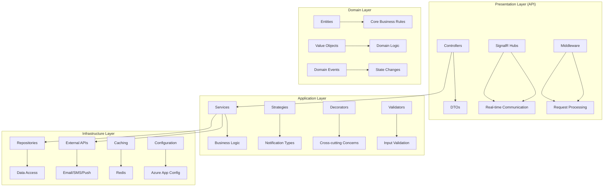

# Notification Service - Architecture Guide

## 🏗️ **System Architecture Overview**

The Notification Service is built following **Clean Architecture** principles with a comprehensive implementation of design patterns, performance optimizations, security features, and DevOps practices.



## 📋 **Architectural Principles**

### **Clean Architecture**
- **Dependency Rule**: Inner layers don't depend on outer layers
- **Domain Independence**: Core business logic is framework-agnostic
- **Testability**: Each layer can be tested in isolation
- **Framework Independence**: Easy to change frameworks or libraries

### **SOLID Principles**
- **Single Responsibility**: Each class has one reason to change
- **Open/Closed**: Open for extension, closed for modification
- **Liskov Substitution**: Subtypes are substitutable for base types
- **Interface Segregation**: Clients depend only on methods they use
- **Dependency Inversion**: Depend on abstractions, not concretions

## 🎯 **Design Patterns Implementation**

### **1. Strategy Pattern**
```csharp
// Interface defining the contract
public interface INotificationStrategy
{
    NotificationType Type { get; }
    Task<NotificationResult> SendAsync(NotificationMessage message, CancellationToken cancellationToken);
}

// Concrete implementations
public class EmailNotificationStrategy : INotificationStrategy
{
    public NotificationType Type => NotificationType.Email;
    // Implementation...
}

public class SmsNotificationStrategy : INotificationStrategy
{
    public NotificationType Type => NotificationType.Sms;
    // Implementation...
}
```

**Benefits:**
- Easy to add new notification types
- Runtime strategy selection
- Testable implementations
- Loose coupling

### **2. Factory Pattern**
```csharp
public interface INotificationStrategyFactory
{
    INotificationStrategy GetStrategy(NotificationType type);
}

public class NotificationStrategyFactory : INotificationStrategyFactory
{
    private readonly IServiceProvider _serviceProvider;

    public INotificationStrategy GetStrategy(NotificationType type)
    {
        return type switch
        {
            NotificationType.Email => _serviceProvider.GetRequiredService<EmailNotificationStrategy>(),
            NotificationType.Sms => _serviceProvider.GetRequiredService<SmsNotificationStrategy>(),
            // ...
        };
    }
}
```

**Benefits:**
- Centralized strategy creation
- Dependency injection integration
- Easy to modify creation logic
- Encapsulates complex instantiation

### **3. Decorator Pattern**
```csharp
public abstract class NotificationDecorator : INotificationService
{
    protected readonly INotificationService _innerService;

    protected NotificationDecorator(INotificationService innerService)
    {
        _innerService = innerService;
    }

    public virtual Task<NotificationResult> SendAsync(NotificationType type, NotificationMessage message, CancellationToken cancellationToken)
    {
        return _innerService.SendAsync(type, message, cancellationToken);
    }
}

public class CachingNotificationDecorator : NotificationDecorator
{
    private readonly IDistributedCache _cache;

    public CachingNotificationDecorator(INotificationService innerService, IDistributedCache cache)
        : base(innerService)
    {
        _cache = cache;
    }

    public override async Task<NotificationResult> SendAsync(NotificationType type, NotificationMessage message, CancellationToken cancellationToken)
    {
        // Caching logic...
        return await _innerService.SendAsync(type, message, cancellationToken);
    }
}
```

**Benefits:**
- Cross-cutting concerns without inheritance
- Runtime behavior modification
- Single Responsibility Principle
- Open/Closed Principle

### **4. Repository Pattern**
```csharp
public interface INotificationRepository
{
    Task<NotificationEntity> GetByIdAsync(Guid id);
    Task<IEnumerable<NotificationEntity>> GetByDateRangeAsync(DateTimeOffset start, DateTimeOffset end);
    Task AddAsync(NotificationEntity entity);
    Task UpdateAsync(NotificationEntity entity);
}

public class NotificationRepository : INotificationRepository
{
    private readonly NotificationDbContext _context;

    public async Task<NotificationEntity> GetByIdAsync(Guid id)
    {
        return await _context.Notifications.FindAsync(id);
    }
    // Implementation...
}
```

## ⚡ **Performance Optimizations**

### **Caching Strategy**
- **Two-level Caching**: Memory + Redis
- **Cache-aside Pattern**: Application manages cache population
- **TTL-based Expiration**: Configurable cache durations
- **Cache Invalidation**: Manual and automatic invalidation

### **Async/Await Patterns**
```csharp
public async Task<NotificationResult> SendAsync(NotificationType type, NotificationMessage message, CancellationToken cancellationToken)
{
    // Concurrent processing
    var tasks = new List<Task<NotificationResult>>();
    foreach (var strategy in _strategies)
    {
        tasks.Add(strategy.SendAsync(message, cancellationToken));
    }

    var results = await Task.WhenAll(tasks);
    return AggregateResults(results);
}
```

### **Message Batching**
```csharp
public async Task<IDictionary<NotificationType, NotificationResult>> SendBatchAsync(
    IDictionary<NotificationType, NotificationMessage> notifications,
    CancellationToken cancellationToken)
{
    var results = new ConcurrentDictionary<NotificationType, NotificationResult>();

    // Parallel processing with batching
    await Parallel.ForEachAsync(notifications, cancellationToken, async (notification, ct) =>
    {
        var result = await SendAsync(notification.Key, notification.Value, ct);
        results[notification.Key] = result;
    });

    return results;
}
```

## 🔒 **Security Architecture**

### **Authentication & Authorization**
- **JWT Bearer Tokens**: Stateless authentication
- **Role-based Access Control**: Admin/User policies
- **Rate Limiting**: IP-based request throttling
- **Security Headers**: XSS, CSRF, HSTS protection

### **Input Validation**
```csharp
public class SendNotificationRequest
{
    [Required]
    [EmailAddress]
    public string To { get; set; } = string.Empty;

    [Required]
    [StringLength(200, MinimumLength = 1)]
    public string Subject { get; set; } = string.Empty;

    [Required]
    [StringLength(5000, MinimumLength = 1)]
    public string Body { get; set; } = string.Empty;
}
```

### **Audit Logging**
```csharp
public interface IAuditLogger
{
    Task LogSecurityEventAsync(string eventType, string description, string userId);
    Task LogNotificationEventAsync(string notificationId, string eventType, string details);
}

public class AuditLogger : IAuditLogger
{
    public async Task LogSecurityEventAsync(string eventType, string description, string userId)
    {
        var auditEntry = new AuditEntry
        {
            EventType = eventType,
            Description = description,
            UserId = userId,
            Timestamp = DateTimeOffset.UtcNow,
            IpAddress = GetClientIpAddress()
        };

        await _repository.AddAsync(auditEntry);
    }
}
```

## 📊 **Monitoring & Observability**

### **Application Metrics**
```csharp
public class DashboardMetricsService
{
    private readonly IMetricsRecorder _metricsRecorder;

    public DashboardMetrics GetCurrentMetrics()
    {
        return new DashboardMetrics
        {
            NotificationsPerMinute = _metricsRecorder.GetCounterValue("notifications_per_minute"),
            SuccessRate = _metricsRecorder.GetGaugeValue("success_rate"),
            AverageResponseTimeMs = _metricsRecorder.GetHistogramMean("response_time"),
            ActiveConnections = _metricsRecorder.GetGaugeValue("active_connections"),
            MemoryUsageMB = GetCurrentMemoryUsage(),
            CpuUsagePercent = GetCurrentCpuUsage()
        };
    }
}
```

### **Health Checks**
```csharp
public class NotificationHealthCheck : IHealthCheck
{
    public async Task<HealthCheckResult> CheckHealthAsync(HealthCheckContext context, CancellationToken cancellationToken)
    {
        var validations = new List<(string, Task<bool>)>
        {
            ("Database", CheckDatabaseConnection()),
            ("Cache", CheckCacheConnection()),
            ("External APIs", CheckExternalApis())
        };

        var results = await Task.WhenAll(validations.Select(async v =>
        {
            try
            {
                var isHealthy = await v.Item2;
                return (v.Item1, isHealthy);
            }
            catch
            {
                return (v.Item1, false);
            }
        }));

        var unhealthy = results.Where(r => !r.Item2).ToList();
        if (unhealthy.Any())
        {
            return HealthCheckResult.Unhealthy($"Unhealthy components: {string.Join(", ", unhealthy.Select(u => u.Item1))}");
        }

        return HealthCheckResult.Healthy("All components are healthy");
    }
}
```

## 🌐 **Real-time Communication**

### **SignalR Implementation**
```csharp
public class NotificationHub : Hub
{
    private static readonly ConcurrentDictionary<string, string> _connections = new();

    public async Task JoinDashboard()
    {
        await Groups.AddToGroupAsync(Context.ConnectionId, "Dashboard");
        _connections[Context.ConnectionId] = "Dashboard";

        await Clients.Caller.SendAsync("JoinedDashboard", GetConnectionCount());
    }

    public async Task LeaveDashboard()
    {
        await Groups.RemoveFromGroupAsync(Context.ConnectionId, "Dashboard");
        _connections.TryRemove(Context.ConnectionId, out _);

        await Clients.Caller.SendAsync("LeftDashboard", GetConnectionCount());
    }

    public static int GetConnectionCount() => _connections.Count;
}
```

## 🚀 **DevOps & Deployment**

### **Infrastructure as Code**
```bicep
// Azure Bicep template for complete infrastructure
resource appService 'Microsoft.Web/sites@2021-02-01' = {
  name: appServiceName
  location: location
  properties: {
    serverFarmId: appServicePlan.id
    httpsOnly: true
    siteConfig: {
      alwaysOn: true
      http20Enabled: true
      appSettings: [
        {
          name: 'ApplicationInsights__InstrumentationKey'
          value: appInsights.properties.InstrumentationKey
        }
        // ... more settings
      ]
    }
  }
}
```

### **CI/CD Pipeline**
```yaml
# GitHub Actions workflow
name: CI/CD Pipeline
on: [push, pull_request]

jobs:
  build-and-test:
    runs-on: ubuntu-latest
    steps:
      - uses: actions/checkout@v3
      - name: Setup .NET
        uses: actions/setup-dotnet@v3
        with:
          dotnet-version: '9.0.x'
      - name: Restore dependencies
        run: dotnet restore
      - name: Build
        run: dotnet build --no-restore
      - name: Test
        run: dotnet test --no-build --verbosity normal
      - name: Publish
        run: dotnet publish -c Release -o ./publish
```

## 🧪 **Testing Strategy**

### **Unit Tests**
```csharp
public class EmailNotificationStrategyTests
{
    [Fact]
    public async Task SendAsync_WithValidMessage_ReturnsSuccessResult()
    {
        // Arrange
        var mockLogger = new Mock<ILogger<EmailNotificationStrategy>>();
        var mockConfig = new Mock<IOptions<EmailConfig>>();
        var strategy = new EmailNotificationStrategy(mockLogger.Object, mockConfig.Object);

        var message = new NotificationMessage("test@example.com", "Subject", "Body");

        // Act
        var result = await strategy.SendAsync(message);

        // Assert
        Assert.True(result.IsSuccess);
        Assert.NotNull(result.MessageId);
    }
}
```

### **Integration Tests**
```csharp
public class NotificationsControllerTests : IClassFixture<WebApplicationFactory<Program>>
{
    private readonly WebApplicationFactory<Program> _factory;

    [Theory]
    [InlineData("test@example.com", "Subject", "Body")]
    public async Task SendNotification_WithValidRequest_ReturnsSuccess(string to, string subject, string body)
    {
        // Arrange
        var client = _factory.CreateClient();
        var request = new { type = "Email", to, subject, body };

        // Act
        var response = await client.PostAsJsonAsync("/api/notifications", request);

        // Assert
        response.EnsureSuccessStatusCode();
        var result = await response.Content.ReadFromJsonAsync<NotificationResponse>();
        Assert.NotNull(result);
        Assert.True(result.Success);
    }
}
```

### **Load Tests**
```csharp
public class NotificationLoadTests
{
    [Fact]
    public void HighVolumeNotifications_ShouldHandleLoad()
    {
        NBomberRunner
            .RegisterScenarios(
                Scenario.Create("high_volume", async context =>
                {
                    // Load test implementation
                    var request = Http.CreateRequest("POST", "/api/notifications");
                    var response = await Http.Send(request);
                    return response.IsSuccessStatusCode ? Response.Ok() : Response.Fail();
                })
                .WithLoadSimulations(
                    Simulation.Inject(rate: 100, interval: TimeSpan.FromSeconds(1), during: TimeSpan.FromMinutes(5))
                )
            )
            .Run();
    }
}
```

## 📈 **Scalability Considerations**

### **Horizontal Scaling**
- **Stateless Design**: No server affinity requirements
- **Distributed Caching**: Redis for shared state
- **Load Balancing**: Azure Front Door/App Gateway
- **Database Scaling**: Azure SQL elastic pools

### **Performance Optimization**
- **Response Compression**: GZIP compression for API responses
- **Connection Pooling**: Database and Redis connection reuse
- **Async Processing**: Non-blocking I/O operations
- **Memory Management**: Efficient object pooling

## 🔧 **Configuration Management**

### **Environment-based Configuration**
```json
{
  "Jwt": {
    "Secret": "your-secret-key",
    "Issuer": "https://yourdomain.com",
    "Audience": "https://yourdomain.com",
    "ExpirationMinutes": 60
  },
  "ConnectionStrings": {
    "NotificationDb": "Server=...;Database=...",
    "Redis": "localhost:6379"
  },
  "FeatureManagement": {
    "EmailNotifications": true,
    "SmsNotifications": true,
    "PushNotifications": false
  }
}
```

### **Azure App Configuration**
```csharp
builder.Configuration.AddAzureAppConfiguration(options =>
{
    options.Connect(connectionString)
           .UseFeatureFlags()
           .Select(KeyFilter.Any, LabelFilter.Null)
           .ConfigureRefresh(refreshOptions =>
           {
               refreshOptions.Register("Sentinel", refreshAll: true);
           });
});
```

## 🎯 **Conclusion**

This Notification Service demonstrates enterprise-grade architecture with:

- **Clean Architecture** for maintainability
- **Design Patterns** for flexibility
- **Performance Optimizations** for scalability
- **Security Features** for protection
- **Monitoring** for observability
- **DevOps Practices** for reliability

The architecture supports:
- Multiple notification types (Email, SMS, Push, Webhook)
- Real-time dashboards with SignalR
- Comprehensive testing and monitoring
- Cloud-native deployment with Azure
- Production-ready features (health checks, graceful shutdown, etc.)

This foundation provides a solid base for enterprise notification systems while remaining flexible for future enhancements.
