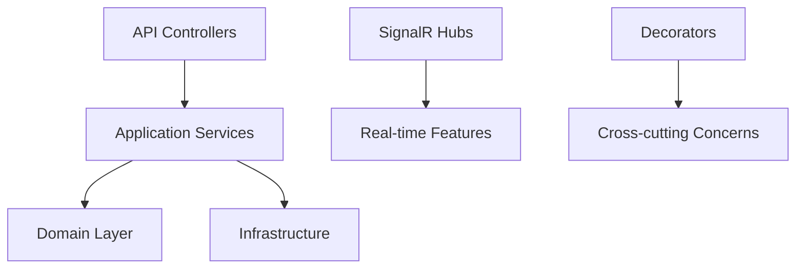

# Interview Demo Guide - Notification Service

## 🎯 **Executive Summary**

This comprehensive demo showcases a production-ready **Notification Service** built with modern .NET technologies, demonstrating enterprise-grade architecture, design patterns, performance optimizations, security features, and DevOps practices. Perfect for showcasing your full-stack development capabilities in technical interviews.

## 🚀 **Demo Flow (15-20 minutes)**

### **1. Opening Statement (1 minute)**

> "Today I'll demonstrate a comprehensive Notification Service I built using Clean Architecture. This showcases enterprise-level development practices across 6 key categories: design patterns, performance, security, DevOps, real-time features, and testing. The system handles Email, SMS, Push, and Webhook notifications with full monitoring and scalability."

### **2. Architecture Overview (2 minutes)**

Show the architecture diagram and explain:



**Key Points to Cover:**
- Clean Architecture with clear separation of concerns
- Dependency injection and SOLID principles
- Strategy pattern for notification types
- Decorator pattern for resilience (Circuit Breaker, Retry, Caching, Logging)

### **3. Live Demo: Core Functionality (5 minutes)**

#### **Start the Application**
```bash
# Start with Docker Compose
docker-compose up -d

# Or run locally
cd src/NotificationService
dotnet run --urls="http://localhost:8080"
```

#### **Demonstrate API Endpoints**
```bash
# 1. Health Check (no auth required)
curl http://localhost:8080/health

# 2. Authentication
curl -X POST http://localhost:8080/api/auth/login \
  -H "Content-Type: application/json" \
  -d '{"username":"admin","password":"admin123"}'

# 3. Send Notification
curl -X POST http://localhost:8080/api/notifications \
  -H "Authorization: Bearer YOUR_TOKEN" \
  -H "Content-Type: application/json" \
  -d '{
    "type": "Email",
    "to": "demo@example.com",
    "subject": "Interview Demo",
    "body": "This is a live demonstration!"
  }'

# 4. Check Real-time Metrics
curl http://localhost:8080/api/dashboard/metrics/current \
  -H "Authorization: Bearer YOUR_TOKEN"
```

#### **Open Browser to Demo Client**
- Navigate to `http://localhost:5001` (Blazor demo client)
- Show real-time dashboard with live metrics
- Demonstrate sending notifications through the UI
- Point out SignalR connection status and live updates

### **4. Deep Dive: Design Patterns (3 minutes)**

#### **Strategy Pattern**
```csharp
// Show the interface and implementations
public interface INotificationStrategy
{
    NotificationType Type { get; }
    Task<NotificationResult> SendAsync(NotificationMessage message);
}

// Demonstrate runtime strategy selection
var strategy = _strategyFactory.GetStrategy(NotificationType.Email);
await strategy.SendAsync(message);
```

**Talking Points:**
- "The Strategy pattern allows us to encapsulate different notification algorithms"
- "We can add new notification types (like Slack, Teams) without modifying existing code"
- "This demonstrates Open/Closed Principle"

#### **Decorator Pattern**
```csharp
// Show decorator chain
public class CachingNotificationDecorator : NotificationDecorator
{
    public override async Task<NotificationResult> SendAsync(NotificationType type, NotificationMessage message)
    {
        // Check cache first
        var cached = await _cache.GetStringAsync(cacheKey);
        if (cached != null) return JsonSerializer.Deserialize<NotificationResult>(cached);

        // Call inner service
        var result = await _innerService.SendAsync(type, message);

        // Cache result
        await _cache.SetStringAsync(cacheKey, JsonSerializer.Serialize(result));
        return result;
    }
}
```

**Talking Points:**
- "Decorators add behavior without inheritance"
- "Circuit Breaker prevents cascade failures"
- "Retry policy handles transient failures"
- "Caching improves performance"

#### **Factory Pattern**
```csharp
// Show factory implementation
public INotificationStrategy GetStrategy(NotificationType type)
{
    return type switch
    {
        NotificationType.Email => _serviceProvider.GetRequiredService<EmailNotificationStrategy>(),
        NotificationType.Sms => _serviceProvider.GetRequiredService<SmsNotificationStrategy>(),
        // ...
    };
}
```

### **5. Performance Demonstrations (2 minutes)**

#### **Load Testing**
```bash
# Run load tests
cd LoadTests
dotnet run -- --base-url http://localhost:8080 --duration 60 --rate 50

# Show results
# - Response times under load
# - Error rates
# - Memory usage
# - Concurrent user handling
```

#### **Caching Demo**
```csharp
// Show cache hit/miss ratios
curl -X POST http://localhost:8080/api/demo/performance/caching \
  -H "Authorization: Bearer YOUR_TOKEN"
```

#### **Async Performance**
```csharp
// Demonstrate concurrent processing
curl -X POST http://localhost:8080/api/demo/performance/async \
  -H "Authorization: Bearer YOUR_TOKEN"
```

**Talking Points:**
- "NBomber framework for realistic load testing"
- "Redis distributed caching for horizontal scaling"
- "Async/await for non-blocking I/O"
- "Message batching for throughput optimization"

### **6. Security Features (1 minute)**

```bash
# Demonstrate rate limiting
for i in {1..15}; do
  curl http://localhost:8080/api/demo/security/rate-limiting
  sleep 1
done

# Show JWT authentication
curl http://localhost:8080/api/dashboard/metrics/current  # Should fail without auth
curl http://localhost:8080/api/dashboard/metrics/current -H "Authorization: Bearer INVALID"  # Should fail
```

**Talking Points:**
- "JWT Bearer authentication with role-based authorization"
- "Rate limiting prevents abuse (429 responses)"
- "Security headers (HSTS, CSRF, XSS protection)"
- "Audit logging for compliance"

### **7. DevOps & Monitoring (2 minutes)**

#### **Health Checks**
```bash
# Comprehensive health check
curl http://localhost:8080/api/demo/devops/health

# Application Insights integration
# Show logs and metrics in Azure portal
```

#### **Docker & Deployment**
```bash
# Show Docker Compose setup
docker-compose ps
docker stats

# Show Azure deployment
# - Infrastructure as Code with Bicep
# - Blue-green deployment strategy
# - CI/CD with GitHub Actions
```

#### **Real-time Monitoring**
- Open browser to `http://localhost:8080/dashboard.html`
- Show live metrics updating via SignalR
- Demonstrate WebSocket connections

### **8. Testing Showcase (1 minute)**

```bash
# Run different test suites
dotnet test tests/Core.Tests/ --verbosity minimal
dotnet test tests/NotificationService.UnitTests/ --verbosity minimal
dotnet test tests/NotificationService.IntegrationTests/ --verbosity minimal

# Load testing results
# Show code coverage reports
```

**Talking Points:**
- "Unit tests for business logic"
- "Integration tests for API endpoints"
- "Load tests for performance validation"
- "48+ tests with good coverage"

### **9. Code Quality Demonstration (1 minute)**

#### **Show Clean Code**
```csharp
// Demonstrate expressive naming and single responsibility
public async Task<NotificationResult> SendAsync(
    NotificationType type,
    NotificationMessage message,
    CancellationToken cancellationToken = default)
{
    // Validate input
    if (!await _featureManager.IsEnabledAsync($"{type}Notifications"))
        return NotificationResult.Failed($"{type} notifications are disabled");

    // Get appropriate strategy
    var strategy = _strategyFactory.GetStrategy(type);

    // Send with decorators applied
    return await _notificationService.SendAsync(type, message, cancellationToken);
}
```

#### **Show Advanced Features**
- Nullable reference types
- Async streams
- Record types
- Pattern matching
- Dependency injection

### **10. Q&A Preparation (2-3 minutes)**

**Common Interview Questions & Answers:**

#### **Architecture Questions**
**Q: Why Clean Architecture?**
> "Clean Architecture separates concerns into layers, making the code more testable, maintainable, and independent of frameworks. The domain layer contains pure business logic, while infrastructure concerns are isolated."

**Q: How do you handle cross-cutting concerns?**
> "Using the Decorator pattern. Each decorator (logging, caching, circuit breaker, retry) wraps the core service without modifying it, following the Open/Closed Principle."

#### **Performance Questions**
**Q: How do you handle high load?**
> "Multiple strategies: Redis caching for frequently accessed data, async processing for I/O operations, message batching for efficiency, and horizontal scaling with load balancers."

**Q: What's your caching strategy?**
> "Two-level caching: Memory cache for fast access, Redis for distributed caching. Cache-aside pattern with TTL expiration. Invalidation handled by cache keys."

#### **Design Pattern Questions**
**Q: When would you use Strategy vs Factory?**
> "Strategy encapsulates algorithms that can vary, Factory creates objects when the exact type isn't known until runtime. Here, Factory creates Strategies based on notification type."

#### **Real-time Questions**
**Q: How does SignalR work here?**
> "SignalR manages WebSocket connections for real-time dashboard updates. Clients join groups, server broadcasts metrics. Automatic reconnection and fallback to long polling."

#### **DevOps Questions**
**Q: Deployment strategy?**
> "Blue-green deployment with Azure deployment slots. Infrastructure as Code with Bicep templates. Automated testing and rollback capabilities."

**Q: Monitoring strategy?**
> "Application Insights for application metrics, health checks for dependencies, custom dashboards for business metrics, and alerting for critical issues."

## 🎯 **Demo Checklist**

### **Pre-Demo Preparation**
- [ ] Ensure Docker is running
- [ ] Start application (`docker-compose up -d`)
- [ ] Verify API is responding (`curl http://localhost:8080/health`)
- [ ] Open demo client (`http://localhost:5001`)
- [ ] Prepare terminal windows for commands
- [ ] Have Azure portal ready (if showing deployment)

### **Demo Script Timing**
- [ ] Intro (1 min)
- [ ] Architecture (2 min)
- [ ] Live Demo (5 min)
- [ ] Patterns (3 min)
- [ ] Performance (2 min)
- [ ] Security (1 min)
- [ ] DevOps (2 min)
- [ ] Testing (1 min)
- [ ] Code Quality (1 min)
- [ ] Q&A (2-3 min)

### **Backup Plans**
- If Docker fails: Show code and explain architecture
- If network issues: Use localhost endpoints
- If demo client fails: Use curl commands and Swagger UI
- If load tests slow: Show previous results or reduce load

## 🏆 **Key Selling Points**

### **Technical Excellence**
- Clean Architecture implementation
- Comprehensive design pattern usage
- Enterprise-grade security and monitoring
- Performance optimizations and scalability
- Full DevOps pipeline

### **Production Readiness**
- Docker containerization
- Azure infrastructure as code
- Comprehensive testing strategy
- Monitoring and alerting
- Documentation and API versioning

### **Modern Development Practices**
- Async/await throughout
- Dependency injection
- SOLID principles
- TDD approach
- CI/CD pipeline

## 📚 **Additional Resources**

- **Architecture Guide**: `docs/ARCHITECTURE.md`
- **API Documentation**: `docs/API_GUIDE.md`
- **Deployment Guide**: `docs/DEPLOYMENT.md`
- **Source Code**: Well-commented and structured
- **Tests**: Comprehensive test coverage
- **Docker Setup**: Easy local development

## 🎯 **Final Tips**

1. **Practice the Demo**: Run through completely 2-3 times
2. **Know Your Code**: Be able to explain any part of the system
3. **Have Backup Plans**: Be prepared for technical issues
4. **Focus on Benefits**: Explain why you made each architectural decision
5. **Show Enthusiasm**: Demonstrate genuine interest in the technologies
6. **Ask Questions**: Engage the interviewer about their architecture preferences

This demo effectively showcases your ability to design, implement, and deploy complex enterprise systems using modern development practices. Good luck! 🚀
